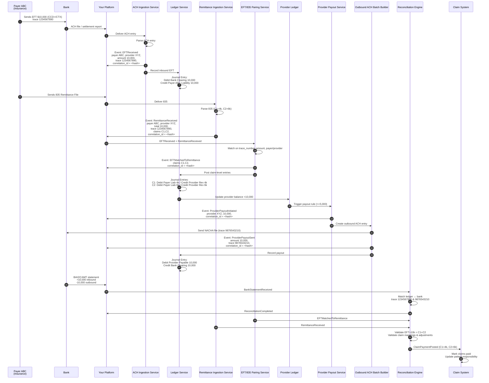

# Markdown with Mermaidjs sequence diagram

```mermaid
sequenceDiagram
    autonumber

    participant Payer as Payer ABC<br/>(Insurance)
    participant Bank as Bank
    participant Platform as Your Platform
    participant ACHIngest as ACH Ingestion Service
    participant Ledger as Ledger Service
    participant RemitIngest as Remittance Ingestion Service
    participant Pairing as EFT/835 Pairing Service
    participant ProvLedger as Provider Ledger
    participant Payout as Provider Payout Service
    participant Batch as Outbound ACH Batch Builder
    participant Recon as Reconciliation Engine
    participant ClaimSys as Claim System

    %% --- 1. EFT ARRIVES ---
    Payer->>Bank: Sends EFT $10,000 (CCD+/CTX)<br/>trace 1234567890
    Bank->>Platform: ACH file / settlement report

    Platform->>ACHIngest: Deliver ACH entry
    ACHIngest->>ACHIngest: Parse ACH entry
    ACHIngest->>Platform: Event: EFTReceived<br/>payer ABC, provider XYZ,<br/>amount 10,000,<br/>trace 1234567890,<br/>correlation_id = <hash>

    ACHIngest->>Ledger: Record inbound EFT
    Ledger->>Ledger: Journal Entry:<br/>Debit Bank Clearing 10,000<br/>Credit Payer ABC Liability 10,000

    %% --- 2. 835 ARRIVES ---
    Payer->>Platform: Sends 835 Remittance File
    Platform->>RemitIngest: Deliver 835
    RemitIngest->>RemitIngest: Parse 835 (C1=4k, C2=6k)
    RemitIngest->>Platform: Event: RemittanceReceived<br/>payer ABC, provider XYZ,<br/>total 10,000,<br/>trace 1234567890,<br/>claims C1,C2,<br/>correlation_id = <hash>

    %% --- 3. PAIRING ---
    Platform->>Pairing: EFTReceived + RemittanceReceived
    Pairing->>Pairing: Match on trace_number, amount, payer/provider
    Pairing->>Platform: Event: EFTMatchedToRemittance<br/>claims C1,C2,<br/>correlation_id = <hash>

    Pairing->>Ledger: Post claim-level entries
    Ledger->>Ledger: Journal Entries:<br/>C1: Debit Payer Liab 4k / Credit Provider Rev 4k<br/>C2: Debit Payer Liab 6k / Credit Provider Rev 6k

    %% --- 4. PROVIDER PAYOUT ---
    Ledger->>ProvLedger: Update provider balance +10,000
    ProvLedger->>Payout: Trigger payout rule (>=5,000)

    Payout->>Platform: Event: ProviderPayoutInitiated<br/>provider XYZ, 10,000,<br/>correlation_id = <hash>

    Payout->>Batch: Create outbound ACH entry
    Batch->>Bank: Send NACHA file (trace 9876543210)
    Batch->>Platform: Event: ProviderPayoutSent<br/>amount 10,000,<br/>trace 9876543210,<br/>correlation_id = <hash>

    Batch->>Ledger: Record payout
    Ledger->>Ledger: Journal Entry:<br/>Debit Provider Payable 10,000<br/>Credit Bank Clearing 10,000

    %% --- 5. BANK RECON ---
    Bank->>Platform: BAI2/CAMT statement<br/>+10,000 inbound<br/>-10,000 outbound
    Platform->>Recon: BankStatementReceived

    Recon->>Recon: Match ledger ↔ bank<br/>trace 1234567890 & 9876543210
    Recon->>Platform: ReconciliationCompleted

    %% --- 6. REMITTANCE RECON ---
    Pairing->>Recon: EFTMatchedToRemittance
    RemitIngest->>Recon: RemittanceReceived
    Recon->>Recon: Validate EFT=10k = C1+C2<br/>Validate claim mappings & adjustments

    Recon->>ClaimSys: ClaimPaymentPosted (C1=4k, C2=6k)
    ClaimSys->>ClaimSys: Mark claims paid<br/>Update patient responsibility
```

