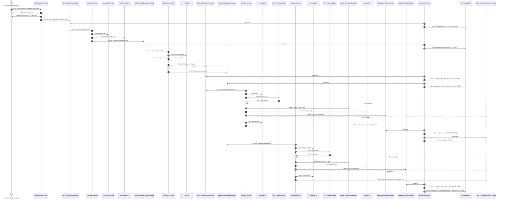

# Load factoring flow

```mermaid
sequenceDiagram
    autonumber

    actor ThirdParty as 3rd Party Email Ingestion
    participant IntakeFn as Azure Function (Intake)
    participant T_EnrichedSent as Kafka: EnrichedPayloadSent
    participant EnrichSvc as Enrichment Service
    participant Blob as Azure Blob Storage
    participant EnrichDB as EnrichmentDB
    participant T_EnrichedRecv as Kafka: EnrichedPayloadReceived
    participant CalcSvc as Calculation Service
    participant CalcDB as CalcDB
    participant T_Billing as Kafka: BillingInvoicePrepared
    participant T_FuelReq as Kafka: FuelAdvanceRequested
    participant InvSvc as Invoicing Service
    participant InvDB as InvoicingDB
    participant ACHFlow as ACH Processing Flow
    participant AdvSvc as Advance Service
    participant AdvDB as AdvanceDB
    participant EFTFlow as EFT Processing Flow
    participant Ledger as Ledger Service (placeholder)
    participant LedgerDB as LedgerDB
    participant T_CarrierPaid as Kafka: CarrierPaymentIssued
    participant T_FuelCard as Kafka: FuelCardDispatched
    participant Orch as Orchestrator Service
    participant OrchDB as OrchestratorDB
    participant T_OrchCtrl as Kafka: Orchestrator Control Events

    %% Intake & Saga Start
    ThirdParty ->> IntakeFn: POST JSON payload (links + extracted fields)
    IntakeFn ->> ThirdParty: 202 Accepted (optional)
    IntakeFn ->> ThirdParty: Download documents via public links
    IntakeFn ->> T_EnrichedSent: Publish EnrichedPayloadSent (JSON + docs)

    Orch ->> T_EnrichedSent: Subscribe
    Orch ->> OrchDB: Create LoadSaga (state=INTAKE_RECEIVED)

    %% Enrichment
    EnrichSvc ->> T_EnrichedSent: Consume EnrichedPayloadSent
    EnrichSvc ->> Blob: Upload documents
    EnrichSvc ->> EnrichDB: Persist fields + Blob URIs
    EnrichSvc ->> T_EnrichedRecv: Publish EnrichedPayloadReceived

    Orch ->> T_EnrichedRecv: Subscribe
    Orch ->> OrchDB: Update saga (state=ENRICHED_STORED)

    %% Calculation
    CalcSvc ->> T_EnrichedRecv: Consume EnrichedPayloadReceived
    CalcSvc ->> CalcDB: Persist calculation input
    CalcSvc ->> CalcSvc: Compute claim, factoring fees, fuel advance check
    CalcSvc ->> T_Billing: Publish BillingInvoicePrepared
    alt Fuel advance requested
        CalcSvc ->> T_FuelReq: Publish FuelAdvanceRequested
    end

    Orch ->> T_Billing: Subscribe
    Orch ->> OrchDB: Update saga (state=BILLING_INVOICE_PREPARED)

    Orch ->> T_FuelReq: Subscribe
    Orch ->> OrchDB: Update saga (state=FUEL_ADVANCE_REQUESTED)

    %% Invoicing (ACH)
    InvSvc ->> T_Billing: Consume BillingInvoicePrepared
    InvSvc ->> InvDB: Persist invoice
    InvSvc ->> ACHFlow: Call ACH Processing
    ACHFlow -->> InvSvc: ACH result (async)

    alt ACH success
        InvSvc ->> Ledger: Update ledger (invoice side)
        InvSvc ->> LedgerDB: Persist ledger entry
        InvSvc ->> T_CarrierPaid: Publish CarrierPaymentIssued
    else ACH failure
        InvSvc ->> InvDB: Mark invoice failed
        InvSvc ->> T_OrchCtrl: Publish CancelInvoice / MarkSagaFailed
    end

    Orch ->> T_CarrierPaid: Subscribe
    Orch ->> OrchDB: Update saga (state=ACH_COMPLETED)

    Orch ->> T_OrchCtrl: Subscribe
    Orch ->> OrchDB: Update saga (state=FAILED)

    %% Advance (Fuel EFT)
    AdvSvc ->> T_FuelReq: Consume FuelAdvanceRequested
    AdvSvc ->> AdvDB: Persist advance request
    AdvSvc ->> EFTFlow: Call EFT Processing
    EFTFlow -->> AdvSvc: EFT result (async)

    alt EFT success
        AdvSvc ->> Ledger: Update ledger (advance side)
        AdvSvc ->> LedgerDB: Persist ledger entry
        AdvSvc ->> T_FuelCard: Publish FuelCardDispatched
    else EFT failure
        AdvSvc ->> AdvDB: Mark advance failed
        AdvSvc ->> T_OrchCtrl: Publish ReverseFuelAdvance / MarkSagaFailed
    end

    Orch ->> T_FuelCard: Subscribe
    Orch ->> OrchDB: Update saga (state=FUEL_ADVANCE_COMPLETED)

    %% Saga Completion
    Orch ->> OrchDB: If ACH + (optional) Fuel Advance complete → state=COMPLETED
```